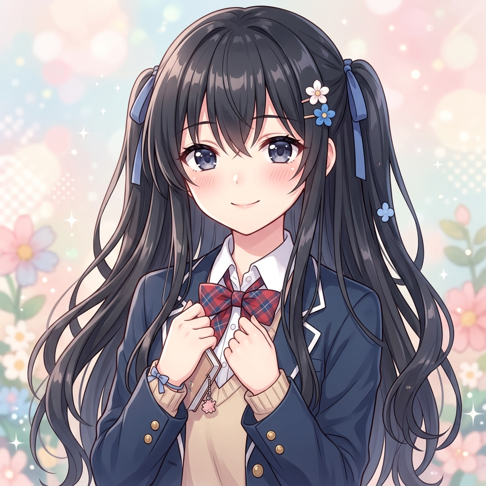
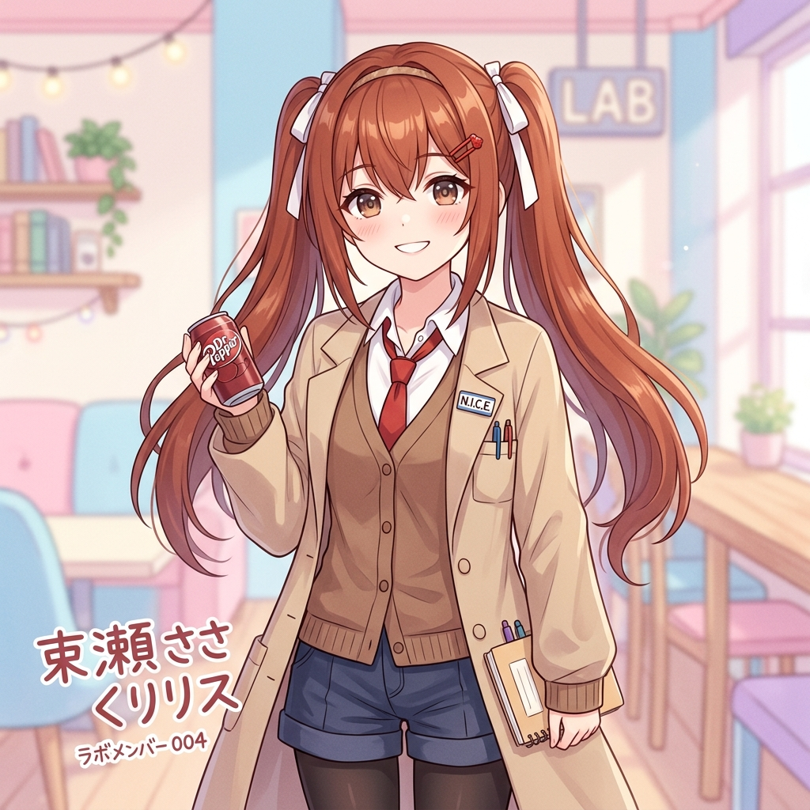
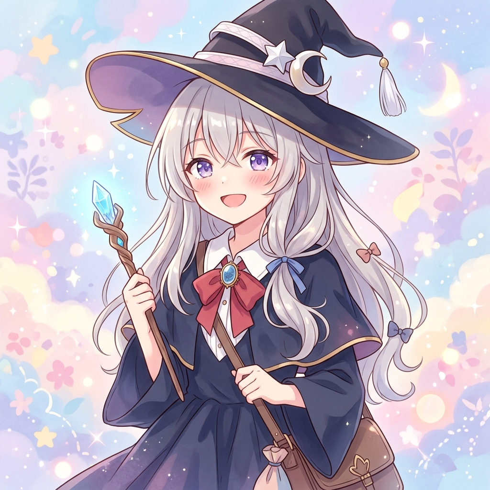

  
  

  
  
  <h2>My GitHub Stats & About Me</h2>

  

    ☁️ Software Engineer • ⚔️ Anime Enjoyer • 💡 Lifelong Learner  
  

  
  <h1 style="margin-top: 15px; font-size: 2em; background: linear-gradient(45deg, #ff6b6b, #f7d794); -webkit-background-clip: text; color: transparent;">Hi, I'm <a href="https://mein-gehirn.tech" style="text-decoration:none; color:inherit;">Bedy Briliant Wijaya 🌸</a></h1>
  
A <strong>Software Engineer</strong> based in <strong>Jakarta</strong>, loving cute microservices &amp; distributed systems. Let’s create adorable, high‑performance apps! 💖

  <a href="https://mein-gehirn.tech#work" style="display:inline-block; margin:8px 12px; padding:8px 16px; background:#ff6b6b; color:#fff; border-radius:6px; text-decoration:none;">Explore Projects ✨</a>
  <a href="https://mein-gehirn.tech#contact" style="display:inline-block; margin:8px 12px; padding:8px 16px; background:#f7d794; color:#fff; border-radius:6px; text-decoration:none;">Get in touch 💌</a>

---

  
  

<h2></h2>

  

    
    
    
  

  <h2>🛠️ Tech Stack</h2>
  

    
    
    
    
  

  <!-- Most Used Language -->
<!-- 

  

 -->

  <!-- Profile Stats -->
<!-- 

  

 -->

  <!-- Snake Animation -->

  

  

  
  

  
  
  

  
  
  

  

<!-- [Visitor Badge](https://visitor-badge.laobi.icu/badge?page_id=bluntswordman.bluntswordman)  -->
